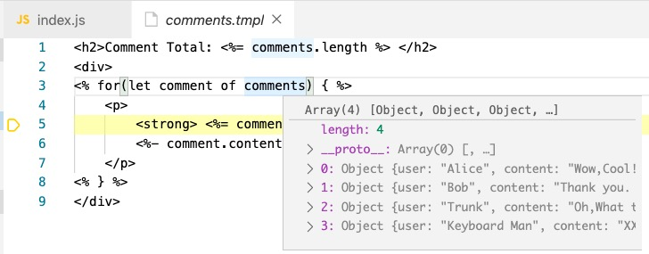

# Light-Template

一个与 [lodash.template](https://lodash.com/docs/4.17.15#template) 相似的模版引擎.

[](https://opensource.org/licenses/MIT)
<a href="https://travis-ci.com/light0x00/light-template"></a> 
<a href="https://www.npmjs.com/package/light-template"></a>

## 特性

- 用原生JS控制模版的渲染
- 支持子模版链接
- 支持模版调试



## 安装

**npm**

```bash
npm install light-template
```

**browser**

```html
<script src="path/to/light-template.min.js"></script>
<script>
	let { default: template } = LIGHT_TEMPLATE
</script>
```

## 示例

```ts
import template from "light-template";

//模版
let tmpl =`<p><%- data.name %><p>
<p><%= data.desc %></p>
<ul><% for(let tag of data.tags){ %>
<li><% print(tag) %></li><% } %>
</ul>`
//数据
let data = {
	name: "<<Alice&Bob>>",
	desc: "How do Alice and Bob prevent Truck",
	tags: [
		"HASH",
		"MAC",
		"RSA",
		"Digital Signature",
		"CA"
	]
}
//编译
let executor = template(tmpl, { variable: "data", soureMap: true }) 
//执行
let result = executor.render(data)

console.log(result)
```

输出:

```html
<p>&lt;&lt;Alice&amp;Bob&gt;&gt;<p>
<p>How do Alice and Bob prevent Truck</p>
<ul>
<li>HASH</li>
<li>MAC</li>
<li>RSA</li>
<li>Digital Signature</li>
<li>CA</li>
</ul>
```

更丰富的例子参考 ➡️ [示例](https://github.com/light0x00/light-template/tree/master/examples)

## 语法

语法基本与 [lodash.template](https://lodash.com/docs/4.17.15#template) 相同,但新增了一个链接指令.

**插值指令**

`<%=` `%>`之间,你可以写一个JS表达式,当然,在这个作用域中,你也可以访问你传入的数据对象,其最终会出现在渲染结果中.

```ts
let tmpl =`<p><%= data.greeting %><p>`
let data = { greeting: "Hello World" }

let exe = template(tmpl, { variable: "data" })
let result = exe.render(data)

console.log(result)
// output:
// <p>Hello World<p>
```

**HTML转义指令**

`<%-` `%>`,它基本上和 `<%=` `%>`相同,除了会转义HTML保留字符. 这可以避免XSS注入.

```ts
let tmpl =`<p><%- data.greeting %><p>`
let data = { greeting: `` }

let exe = template(tmpl, { variable: "data" })
let result = exe.render(data)

console.log(result)
// output:
// <p>&lt;img src=&quot;xss&quot;&gt;<p>
```

**脚本块指令**

`<%` `%>` 之间可以编写任意的JS代码,提供了一个内置的print函数,用于输出内容到最终的模版.

```ts
let tmpl =`<ul>
<% 
for(let user of users){
	print('<li>'+user+'</li>')
} 
%>
</ul>`
let data = ["Alice","Bob"]

let result = template(tmpl, { variable: "users", soureMap: true }).render(data)

console.log(result)
// output:
// <ul>
// <li>Alice</li><li>Bob</li>
// </ul>
```

**链接子模版**

`<%@` `%>` 之间可以指定要插入的子模版的名称,当light-template遇到链接指令时,都将要链接的模版名称传给加载器,由加载器返回模版的内容,然后进行编译. 需注意,这个名称不一定是路径名,只要可以标识一个唯一的模版即可.

```ts
let tmpls = new Map()
tmpls.set("greeting.tmpl", `Hello,<%= user.name %>`)

//模版加载器
let sourceLoader = (sourceName) => {
	if (!tmpls.has(sourceName))
		throw new Error("Can't find template named " + sourceName)
	return tmpls.get(sourceName)
}

//入口模版
let entry = `<p><%@ greeting.tmpl %></p>`  // 使用 <%@ 链接一个子模版

//编译
let exe = template(entry, { variable: "user", sourceLoader, soureMap: true })

//渲染
let result = exe.render({ name: "Alice" })

console.log(result)

// output:
// <p>Hello,Alice</p>
```

**保留字符转义**

`<%`、`%>`是保留字符, 如果要用作文本,使用`\`转义

```ts
let tmpl ="脚本块的语法是:\\<% code \\%>"  //这里有两个`\` 是因为`\`在JS中也是特殊字符,因此要加一个`\`转义
let result = template(tmpl, { variable: "data", soureMap: true }).render({})

console.log(result)
// output:
//脚本块的语法是:<% code %>
```

## 原理

将模版编译为一个JavaScript函数, 该函数接收一个data,以拼接字符串的形式生成最终的模版.

```html
<p><%= data.greeting %><p>
```

⬇️

```js
function(data){
	let __p = ""
	__p+="<p>"+ data.greeting +"<p>"
	return __p
}
```

## API

**template**

```ts
template(tmpl: string, options?: TemplateSettings): TemplateExecutor
```

- tmpl ,模版内容
- TemplateSettings
	- `variable?: string`,指定数据对象在模版中的变量名,可通过该变量引用数据对象
	- `soureMap?: boolean`,是否生成sourceMap
	- `sourceName? : string` ,指定入口模版的名称,在调试的时候方便区分模版.
	- `sourceLoader? : (soureName :string)=>string`, 模版源码加载器,当要使用子模版嵌入指令(`<%@`)时须指定,该函数接收一个模版名称,返回模版内容.
- TemplateExecutor
	- `render(data :any)`,接收一个数据对象对模版进行渲染
	- `source: string`,生成的渲染函数

**compile**

```ts
compile(tmpl: string, settings?: TemplateSettings): string
```
与template的区别是,此方法仅返回渲染函数的字符串形式. 

## 其他

**with**

JS中的with关键字可以将一个变量的属性作为一个作用域的上下文

```js
let obj = { x :1 ,y:2 }
with(obj){
	//可以直接使用obj的属性
	z=x+y
}
```

如果把这一特性用在模版中,原本要`<%= data.greeting %>`,而现在可直接通过 `<%= greeting %>`访问数据对象.
但是,with是一个过期的特性,strict 模式中使用with会直接抛出异常, 因此舍弃了提供该功能.


